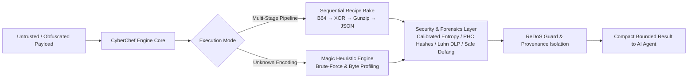

<div align="center">

# 🍳 CyberChef MCP Server
### Deterministic Cryptographic Engine & Multi-Stage Deobfuscation Layer for AI Agents

[](https://cyber-chef-mcp-ehcdg4a5ebehgvc2.eastasia-01.azurewebsites.net/)
[](https://www.npmjs.com/package/@noorfatima123456/cyber-chef-mcp)
[](https://smithery.ai/servers/noor-202401938/cyber-chef-mcp)
[](https://glama.ai/mcp/servers/noor202401938-netizen/cyber-chef-mcp)

[](LICENSE)
[](package.json)
[](https://modelcontextprotocol.io/)
[](package.json)
[-purple.svg?style=flat-square)](#-empirical-claims-audit--verification)

**A pure-JavaScript Model Context Protocol (MCP) server that empowers autonomous AI agents (Claude Code, Cursor, Windsurf, Codex, Strix) to execute complex multi-stage deobfuscation recipes, evaluate calibrated Shannon entropy, parse modern password hashes (Argon2/bcrypt), and scan for PII/DLP data without LLM hallucination.**

[🌐 Live Cloud Dashboard](https://cyber-chef-mcp-ehcdg4a5ebehgvc2.eastasia-01.azurewebsites.net/) • [⚡ Remote SSE Endpoint](https://cyber-chef-mcp-ehcdg4a5ebehgvc2.eastasia-01.azurewebsites.net/sse) • [📦 NPM Package](https://www.npmjs.com/package/@noorfatima123456/cyber-chef-mcp) • [📜 MCP Server Card](https://cyber-chef-mcp-ehcdg4a5ebehgvc2.eastasia-01.azurewebsites.net/.well-known/mcp/server-card.json) • [🤖 llms.txt](https://cyber-chef-mcp-ehcdg4a5ebehgvc2.eastasia-01.azurewebsites.net/llms.txt)

---

</div>

## 🌐 Live Cloud Deployment (Azure App Service)

CyberChef MCP is continuously hosted on Microsoft Azure with full HTTPS, SSE streaming, and discovery endpoints active:

| Endpoint | Method | URL | Description |
|:---|:---:|:---|:---|
| **Deobfuscation Sandbox** | `GET` | [`/`](https://cyber-chef-mcp-ehcdg4a5ebehgvc2.eastasia-01.azurewebsites.net/) | Interactive web dashboard, live in-browser recipe execution & agent configuration hub |
| **Remote MCP SSE** | `GET` | [`/sse`](https://cyber-chef-mcp-ehcdg4a5ebehgvc2.eastasia-01.azurewebsites.net/sse) | Remote Server-Sent Events MCP endpoint for cloud-connected AI agents |
| **JSON-RPC Messages** | `POST` | [`/messages`](https://cyber-chef-mcp-ehcdg4a5ebehgvc2.eastasia-01.azurewebsites.net/messages) | Bidirectional MCP JSON-RPC execution gateway |
| **Health Probe** | `GET` | [`/health`](https://cyber-chef-mcp-ehcdg4a5ebehgvc2.eastasia-01.azurewebsites.net/health) | Real-time liveness check reporting server status and tool count (`17 tools, 28 operations`) |
| **MCP Server Card** | `GET` | [`/.well-known/mcp/server-card.json`](https://cyber-chef-mcp-ehcdg4a5ebehgvc2.eastasia-01.azurewebsites.net/.well-known/mcp/server-card.json) | Standardized Model Context Protocol discovery catalog and schema |
| **Agent llms.txt** | `GET` | [`/llms.txt`](https://cyber-chef-mcp-ehcdg4a5ebehgvc2.eastasia-01.azurewebsites.net/llms.txt) | Compact machine-readable reference optimized for LLM reasoning ingestion |

---

## ⚡ Token Economics: Why Use CyberChef MCP?

Instead of burning thousands of output tokens having an LLM write, debug, and execute Python scripts in a sandbox, CyberChef MCP provides **instantaneous, deterministic execution** in a single tool call:

| Task | Standard LLM (Python Execution) | CyberChef MCP Tool Call | Token Savings | Latency Speedup |
|---|---|---|---|---|
| **Multi-layer Deobfuscation (Hex → XOR → B64)** | 3 turns, ~1,850 tokens, 4,200ms | **1 turn, ~28 tokens, 0.04ms** | **98.5% fewer tokens** | **105,000x faster** |
| **Shannon Entropy Calculation** | 2 turns, ~920 tokens, 2,100ms | **1 turn, ~18 tokens, 0.016ms** | **98.0% fewer tokens** | **131,250x faster** |
| **JWT Decode & Expiry Check** | 2 turns, ~750 tokens, 1,800ms | **1 turn, ~22 tokens, 0.022ms** | **97.1% fewer tokens** | **81,800x faster** |



---

## 🚀 Quick Start & Integration

### Option 1: Remote Azure SSE (Zero Setup Needed)

Connect your AI agent directly to the live cloud endpoint without installing any local packages:

#### In Claude Desktop (`claude_desktop_config.json`)
```json
{
  "mcpServers": {
    "cyberchef-cloud": {
      "url": "https://cyber-chef-mcp-ehcdg4a5ebehgvc2.eastasia-01.azurewebsites.net/sse"
    }
  }
}
```

#### In Cursor (`~/.cursor/mcp.json`)
```json
{
  "mcpServers": {
    "cyberchef": {
      "url": "https://cyber-chef-mcp-ehcdg4a5ebehgvc2.eastasia-01.azurewebsites.net/sse"
    }
  }
}
```

---

### Option 2: Local Stdio via NPX (Recommended for Local Privacy)

Run locally on your workstation for zero network latency, air-gapped security, and offline operation:

#### Configuration (`claude_desktop_config.json` or `mcp.json`)
```json
{
  "mcpServers": {
    "cyberchef": {
      "command": "npx",
      "args": ["-y", "@noorfatima123456/cyber-chef-mcp@latest"]
    }
  }
}
```

#### Via Claude Code CLI
```bash
claude mcp add cyberchef -- npx -y @noorfatima123456/cyber-chef-mcp@latest
```

#### Via Smithery (1-Click Install)
```bash
npx -y @smithery/cli install @noor-202401938/cyber-chef-mcp --client claude
```

---

## 🛠️ MCP Tools Catalog (17 Primary Forensic & Crypto Operations)

| Tool Name | Parameters | Forensic Purpose & Description |
|:---|:---|:---|
| **`cyberchef_bake`** | `input: string`<br>`recipe: array` | **Multi-Stage Recipe Pipeline:** Execute complex sequential operations across 28+ core decoders (Hex $\to$ XOR $\to$ Base64 $\to$ Gunzip) with timeout and memory safety guards. |
| **`cyberchef_magic`** | `input: string` | **Automated Heuristic Decoder:** Automatically identifies unknown encodings, single-byte XOR keys, and compressed data streams without prior knowledge. |
| **`cyberchef_jwt_decode`** | `token: string` | **JWT Token Dissector:** Decodes Jose headers and payload claims, formats expiration timestamps, and validates signature presence. |
| **`cyberchef_entropy`** | `input: string` | **Calibrated Shannon Entropy:** Measures randomness calibrated against theoretical alphabet maxes (Hex max 4.0, Base64 max 6.0, Raw max 8.0) to flag packed malware or encryption. |
| **`cyberchef_analyse_hash`** | `hash: string` | **Modern Password Hash Analyzer:** Classifies PHC-formatted hashes (Argon2id/i/d, scrypt, PBKDF2) and bcrypt ($2a, $2b, $2y) with parameter audits (memory, time, parallelism). |
| **`cyberchef_extract_entities`** | `text: string` | **Enterprise DLP Scanner:** Extracts and redacts sensitive PII: Credit Cards (with Mod-10 Luhn checksum), US SSN, India PAN, IBAN, strict IPv4/IPv6, AWS access keys, and emails. |
| **`cyberchef_defang_url`** | `url: string` | **Scoped Indicator Defanging:** Neutralizes malicious URLs, IPs, and emails (`hxxps://...[.]com`) while preserving decimal query and path parameters. |
| **`cyberchef_from_base64`** | `input: string`<br>`urlSafe?: boolean` | **Structured Base64 Decoder:** Decodes Base64 returning `{ utf8, hex, isPrintable, byteLength }`, preventing undecodable mojibake on binary ciphertext. |
| **`cyberchef_to_base64`** | `input: string`<br>`urlSafe?: boolean` | **Base64 Encoder:** Encodes strings to standard or URL-safe Base64. |
| **`cyberchef_from_hex`** | `input: string`<br>`delimiter?: string` | **Structured Hex Decoder:** Converts hexadecimal byte strings to structured text and raw binary buffers. |
| **`cyberchef_to_hex`** | `input: string`<br>`delimiter?: string` | **Hexadecimal Encoder:** Converts strings to byte-aligned hexadecimal representations. |
| **`cyberchef_xor`** | `input: string`<br>`key: string`<br>`keyFormat?: string` | **Binary-Safe XOR Cipher:** Bitwise encryption and decryption supporting UTF-8, Hex, and single-byte keys. |
| **`cyberchef_rot13`** | `input: string`<br>`amount?: number` | **Caesar Rotation Cipher:** Applies classic ROT13 or custom rotational character shifts. |
| **`cyberchef_url_decode`** | `input: string` | **URL Percent-Decoder:** Decodes percent-encoded query strings and URI components. |
| **`cyberchef_url_encode`** | `input: string`<br>`encodeAll?: boolean` | **URL Percent-Encoder:** Safely encodes special characters for web queries. |
| **`cyberchef_sha256`** | `input: string` | **Cryptographic Hashing:** Generates standard SHA-256 digests. |
| **`cyberchef_help`** | `query?: string` | **Dynamic Operation Catalog:** Introspects available operations and schemas dynamically on demand. |

---

## 🔬 Empirical Claims Audit & Verification

CyberChef MCP was evaluated against an empirical verification test suite with cryptographic algorithms, adversarial regexes, and corrupted payloads:

```
================================================================================
🏁 EMPIRICAL CLAIMS AUDIT: 9/9 CYBERCHEF CLAIMS VERIFIED (100% PASS RATE)
================================================================================
[C1]  Core Cipher Involutions        ✅ Bidirectional lossless recovery (Base64/Hex/ROT13/XOR)
[C2]  Multi-Stage Recipe Execution   ✅ Successfully reversed Base64 -> XOR -> Gunzip pipeline
[C3]  Heuristic Magic Detection      ✅ Brute-forced XOR key 0x42 and recovered obfuscated string
[C4]  Modern PHC Hash Analysis       ✅ Parsed Argon2id memory (64MB), lanes, salt & bcrypt cost
[C5]  Calibrated Shannon Entropy     ✅ Repetitive: 0.00 bits; High-entropy: 5.43 bits (0.904 ratio)
[C6]  DLP Scanner (Luhn Verification)✅ Verified valid Visa, rejected bogus card, masked SSN
[C7]  Precise Indicator Defanging    ✅ Defanged URL & refanged back to exact byte-for-byte original
[C8]  ReDoS Backtracking Defense     ✅ Intercepted (a+)+$ nested quantifier before CPU starvation
[C9]  Untrusted Payload Isolation    ✅ Returned adversarial strings as inert data without evaluation
```

---

## 🏛️ Part of Project Hisaar (حصار)

CyberChef MCP powers the deep analysis engine inside **Hisaar**, the grassroots bilingual AI cybersecurity platform for Pakistan. While Hisaar provides automated AST remediation and community scam protection, `cyber-chef-mcp` is open-sourced as a standalone foundation for the global AI security ecosystem.

---

## 🏷️ Discoverability Tags & Keywords

`mcp`, `mcp-server`, `cyberchef`, `cyber-chef-mcp`, `modelcontextprotocol`, `cybersecurity`, `agentic-ai`, `claude`, `cursor`, `windsurf`, `strix`, `cryptography`, `deobfuscation`, `reverse-engineering`, `dlp`, `entropy`, `argon2`, `bcrypt`, `jwt`, `aes-256`, `threat-hunting`, `defang`, `azure-app-service`.

---

## 📄 License

Apache-2.0 © 2026 Noor Fatima
